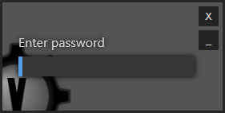
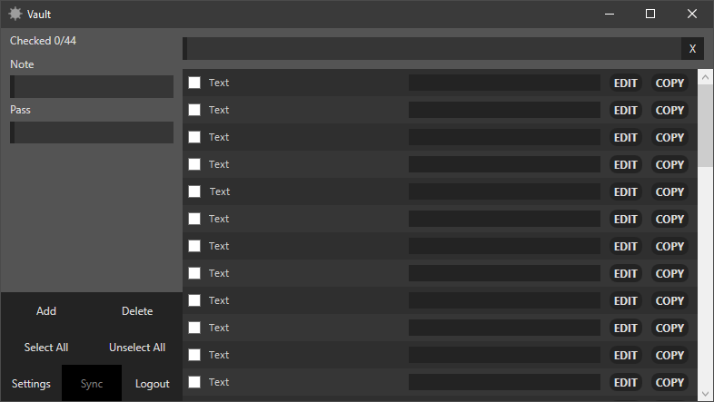
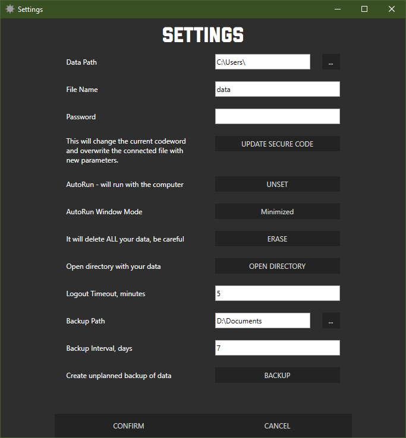

# VaultPC

App to store your login-pass values

## Functions

* Adding/Editing/Deleting note-pass value
* Searching by key word
* Coping to clipboard
* Log in/Log out by password
* Encrypting data
* Planned/unplanned backup of data
* Sync between devices in local network [in progress]

## Screenshots

* Login
  
  

* Vault 
  
  

* Settings
  
  

## See also

I created similar app for mobile phones -> https://github.com/maxshymchuk/Vault